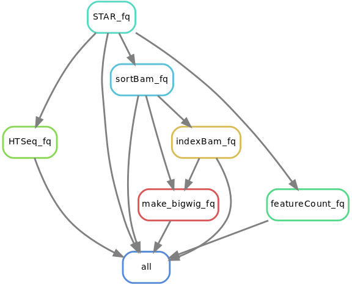
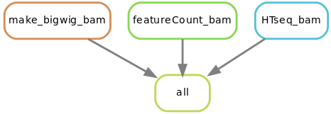
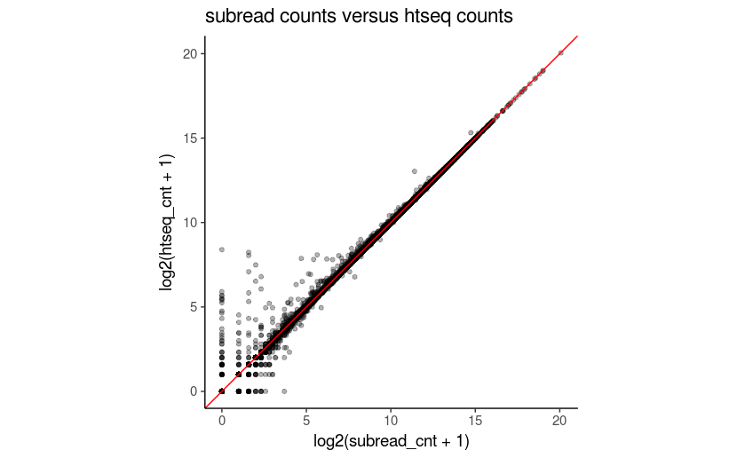

### citation

If you use this pipeline, please cite:
[](https://doi.org/10.5281/zenodo.842264)

### work flow of the pipeline
* If inputs are fastq files:



The output folder will be suffixed by `_fq`

* If inputs are bam files:



The output folder will be suffixed by `_bam`

you can sepcify the inputs are fastqs or bams in the `config.yaml` file.

### htseq-count or subread

you can choose to run htseq-count and (or) featureCount in the `config.yaml`file.
featureCount  is much faster (using 10 thread a mouse RNAseq data with 10gb size finish in 10 mins), while htseq-count may run 5 hours.

The count results are very similar. Htseq does some read quality filtering though. for featureCount, you have to specify in the arguments. now it is set to 0.



Importantly, featureCount requires a Name sorted bam file http://seqanswers.com/forums/showthread.php?t=49687

That's why in the STAR command, I specified `--outSAMtype BAM Unsorted`.

if the bam file is coordinate sorted, feature-count will resort it and it may be  time-consuming.

For the newest version of feature-count (v1.5.2), if the bam files are not sorted by Name, featureCounts will sort it on the fly.

what I found is that even I specified `--outSAMtype BAM Unsorted`, featureCounts sometimes still complains that the bam files are not sorted by Name. I guess it has to do with multi-mapping.

https://groups.google.com/forum/#!topic/subread/pBjWETghQr0

> When you count fragments ("-p") and turn on the "--donotsort" option, featureCounts will take two reads at a time from the input and treat them as the reads from the same pair. If there are for example three lines having the same read id (ie. from the same fragment/pair), then the last line will be used together with the read after it for counting. This will result in incorrect fragment counting because reads were incorrectly paired.


I may change the STAR `--outSAMtype BAM SortedByCoordinate` to save me from sorting later by coordinates.

### naming conventions of the files


the prefix before `.bam` or `.fastq.gz` will be used to name the files.

`1-Kdm2a-RasG12D-1079_S43_L007_R1_001.fastq.gz`

`1-Kdm2a-RasG12D-1079_S43_L007_R2_001.fastq.gz`

* If input are fastqs, `R1` and `R2` will be used to determine the forward reads and reverse reads.


### How to distribute workflows

read [doc](https://snakemake.readthedocs.io/en/stable/snakefiles/deployment.html)

```bash
ssh shark.mdanderson.org

# start a screen session
screen

# make a folder, name it yourself, I named it workdir
mkdir /rsch2/genomic_med/krai/workdir/

cd /rsch2/genomic_med/krai/workdir/

git clone https://gitlab.com/tangming2005/STAR_htseq_RNAseq_pipeline

cd STAR_htseq_RNAseq_pipeline

## go to shark branch
git checkout shark

## edit the config.yaml file as needed, e.g. set mouse or human for ref genome, p value cut off for peak calling, the number of reads you want to downsample to
nano config.yaml

## skip this if on Shark, samir has py351 set up for you. see below STEPS
conda create -n snakemake python=3 snakemake
source activate snakemake
```

## STEPS

### on nautilus

there is a python3 environment set up. just do

```bash
source activate py351
```


### create the sample.json file  by feeding a fastq folder or bam folder. this folder should be a folder containing all the samples.

please use the **full path** for the folder that contains your fastq folders.

`python3 fastq2json.py --fastq_dir /path/to/the/fastq/`

`python3 bam2json.py --bam_dir /path/to/the/bam/`

e.g.

```bash
raw_rnaseq/
├── Sample_1-Kdm2a-RasG12D-1079
│   ├── 1-Kdm2a-RasG12D-1079_S43_L007_R1_001.fastq.gz
│   └── 1-Kdm2a-RasG12D-1079_S43_L007_R2_001.fastq.gz
├── Sample_2-Kdm2a-RasG12D-1031
│   ├── 2-Kdm2a-RasG12D-1031_S44_L007_R1_001.fastq.gz
│   └── 2-Kdm2a-RasG12D-1031_S44_L007_R2_001.fastq.gz
├── Sample_3-Mll4-RasG12D-1527
│   ├── 3-Mll4-RasG12D-1527_S45_L007_R1_001.fastq.gz
│   └── 3-Mll4-RasG12D-1527_S45_L007_R2_001.fastq.gz
├── Sample_4-Mll4-RasG12D-1576
│   ├── 4-Mll4-RasG12D-1576_S46_L007_R1_001.fastq.gz
│   └── 4-Mll4-RasG12D-1576_S46_L007_R2_001.fastq.gz
├── Sample_5-RasG12D-1475
│   ├── 5-RasG12D-1475_S47_L007_R1_001.fastq.gz
│   └── 5-RasG12D-1475_S47_L007_R2_001.fastq.gz
└── Sample_6--RasG12D-1508
    ├── 6--RasG12D-1508_S48_L007_R1_001.fastq.gz
    └── 6--RasG12D-1508_S48_L007_R2_001.fastq.gz

```

`python3 fastq2json.py --fastq_dir /rsch2/genomic_med/krai/raw_rnaseq/`

check the file information in the json file:

```
less -S samples.json
```

### dry run to test

```bash
## dry run
snakemake -np
```

if no errors, preceed below.

### Using [DRMAA](https://www.drmaa.org/)

[job control through drmaa](http://drmaa-python.readthedocs.io/en/latest/tutorials.html#controlling-a-job)

DRMAA is only supported on `Shark`.

```bash
module load drmma
./pyflow-drmaa-RNAseq.sh
```

Using `drmaa` can `control + c` to stop the current run.

Dependent jobs are submitted one by one, if some jobs failed, the pipeline will stop. Good for initital testing.

### submit all jobs to the cluster

```bash
./pyflow-RNAseq.sh
```

All jobs will be submitted to the cluster on queue.  This is useful if you know your jobs will succeed for most of them and the jobs are on queue to gain priority.

### job control

To kill all of your pending jobs you can use the command:

```bash
bkill ` bjobs -u krai |grep PEND |cut -f1 -d" "`
```

```
bjobs -pl
Display detailed information of all pending jobs of the invoker.

bjobs -ps
Display only pending and suspended jobs.

bjobs -u all -a
Display all jobs of all users.

bjobs -d -q short -m apple -u mtang1
Display all the recently finished jobs submitted by john to the
queue short, and executed on the host apple.

```

### rerun some of the jobs

```bash

# specify the name of the rule, all files that associated with that rule will be rerun. e.g. rerun htseq count rule,
./pyflow-RNAseq.sh -R htseq_fq

# process unitil htseq_fq
./pyflow-RNAseq.sh -R  --until htseq_fq

# process unitl htseq_fq, force rerun all files related to this step
./pyflow-RNAseq.sh -FR --until htseq_fq
## rerun one sample, just specify the name of the target file

./pyflow-ChIPseq.sh -R mysampleAligned.out.bam
```

### checking results after run finish

```bash

snakemake --summary | sort -k1,1 | less -S

# or detailed summary will give you the commands used to generated the output and what input is used
snakemake --detailed-summary | sort -k1,1 > snakemake_run_summary.txt
```


### clean the folders

I use echo to see what will be removed first, then you can remove all later.

```
find . -maxdepth 1 -type d -name "[0-9]*" | xargs echo rm -rf
```


### Snakemake does not trigger re-runs if I add additional input files. What can I do?

Snakemake has a kind of “lazy” policy about added input files if their modification date is older than that of the output files. One reason is that information what to do cannot be inferred just from the input and output files. You need additional information about the last run to be stored. Since behaviour would be inconsistent between cases where that information is available and where it is not, this functionality has been encoded as an extra switch. To trigger updates for jobs with changed input files, you can use the command line argument –list-input-changes in the following way:

```bash
snakemake -n -R `snakemake --list-input-changes`

```

### How do I trigger re-runs for rules with updated code or parameters?

```bash
snakemake -n -R `snakemake --list-params-changes`
```

and

```bash
$ snakemake -n -R `snakemake --list-code-changes`
```
### Acknowledgements

Thanks [Samir Amin](https://github.com/dyndna) for providing the STAR aligning parameters.
